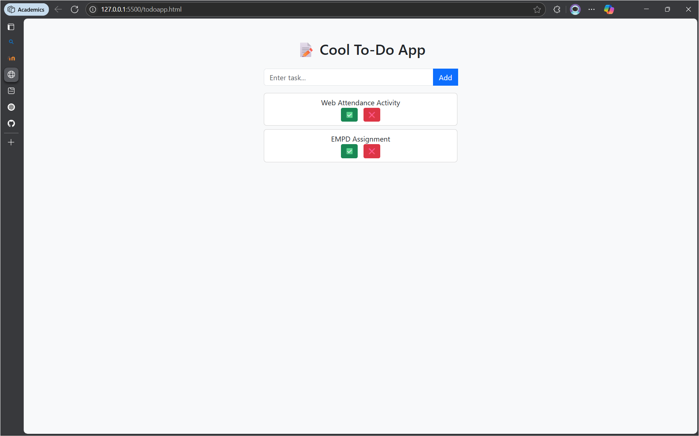

# 📝 Cool To-Do App

A clean and minimal to-do list application built using HTML, CSS (Bootstrap), and JavaScript. This app helps you manage tasks with a simple interface and provides features to add, complete, and delete tasks dynamically.

## 🚀 Features

- ✅ Add new tasks with a single click
- 🗑️ Delete tasks instantly
- ✔️ Mark tasks as completed (with visual indication)
- 💡 Responsive and mobile-friendly design using Bootstrap 5
- 🎨 Smooth UI transitions for a better user experience

## 📸 Demo


## 🛠️ Technologies Used

- HTML5
- CSS3 (with [Bootstrap 5](https://getbootstrap.com/))
- JavaScript (Vanilla JS)
- [Font Awesome](https://fontawesome.com/) for icons

## `index.html`
```
<!DOCTYPE html>
<html lang="en">
<head>
    <meta charset="UTF-8">
    <meta name="viewport" content="width=device-width, initial-scale=1.0">
    <title>Cool To-Do App</title>
    <link rel="stylesheet" href="https://cdn.jsdelivr.net/npm/bootstrap@5.3.0/dist/css/bootstrap.min.css">
    <script defer src="https://cdn.jsdelivr.net/npm/bootstrap@5.3.0/dist/js/bootstrap.bundle.min.js"></script>
    <script defer src="https://kit.fontawesome.com/a076d05399.js"></script>
    <style>
        .container { max-width: 450px; }
        .finished { text-decoration: line-through; opacity: 0.6; }
        .task-card { transition: all 0.3s ease-in-out; }
    </style>
</head>
<body class="bg-light">
    <div class="container mt-5">
        <h2 class="text-center mb-4">📝 Cool To-Do App</h2>

        <!-- Input Field -->
        <div class="input-group mt-3">
            <input type="text" id="taskInput" class="form-control" placeholder="Enter task...">
            <button class="btn btn-primary" onclick="addTask()">Add</button>
        </div>

        <!-- Task List -->
        <div id="taskList" class="mt-3"></div>
    </div>

    <script>
        function addTask() {
            let input = document.getElementById("taskInput");
            let taskText = input.value.trim();
            if (!taskText) return;

            let taskCard = document.createElement("div");
            taskCard.className = "task-card card p-2 mb-2 d-flex justify-content-between align-items-center";
            taskCard.innerHTML = `
                <span>${taskText}</span>
                <div>
                    <button class="btn btn-success btn-sm me-2" onclick="markFinished(this)">✅</button>
                    <button class="btn btn-danger btn-sm" onclick="deleteTask(this)">❌</button>
                </div>
            `;
            document.getElementById("taskList").appendChild(taskCard);
            input.value = "";
        }

        function markFinished(btn) {
            btn.parentElement.parentElement.querySelector("span").classList.toggle("finished");
        }

        function deleteTask(btn) {
            btn.parentElement.parentElement.classList.add("fade-out");
            setTimeout(() => btn.parentElement.parentElement.remove(), 300);
        }
    </script>
</body>
</html>
```
## 📂 Project Structure

```plaintext
cool-todo-app/
├── index.html           # Main HTML file containing the app
